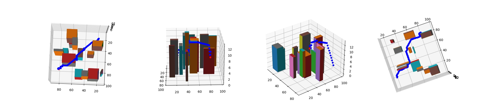
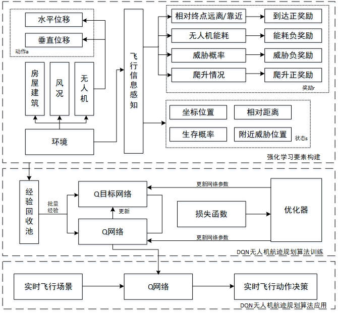

🌍
*∙ [简体中文](README.md)∙ [English](README-el.md)

# DQN-based-UAV-3D_path_planer
Realization of UAV's Track Planning in 3D Urban Environment Based on Reinforcement Learning Algorithm(DQN)

## requirement
python 3.7

pytorch(cuda)

## performance
In the three-dimensional space of x100 y100 z22, the UAV agent is trained by the curriculum learning method, and the gradient training of the agent is carried out using the set courses of different difficulty, so that the agent can acquire decision-making experience faster. Due to the lack of decision-making experience in the early stage of training, it is necessary to randomly select behaviors to test the environment. In this paper, the random testing period is set to 1000, and the ε-greedy strategy is used to select agent behaviors during the period. The greedy probability in the period gradually decreases from 1 to 0.01. After 1000 cycles The greedy probability remains at 0.01. Randomly generate 15 drone objects in one cycle of training scenarios. When all drones enter the termination state (power exhaustion, crash, reach the target point, exceed the maximum step size), enter the next cycle of training, when 80 When more than % of the drones can reach the target point, they will enter the training of the next difficulty level.
After 130,000 cycles and 19 hours of iterative training, the final UAV agent can safely reach the target point with a high task completion rate in an environment of difficulty 10.

## Introduction
DQN.py: (main function entry 1) Set the model training parameters and urban environment parameters, train the DQN model, and output the Qlocal.pth and Qtarget.pth files

env.py: Set the env class, describe the city environment, and realize the simulation of all UAVs and sensors in the environment.

model.py: Definition of neural network model

replay_buffer.py: Definition of the experience pool

UAV.py: Define the UAV class to describe the UAV's own parameters and behavior

## Structure

## Parameter option
env.py:
~~~ 
  #Randomly generate the house building set, UAV set, and sensor set in the simulation environment, and initialize the training environment
  env.reset()  
  
  #Set the simulation environment parameters
  env. __init__() 
~~~
DQN.py
~~~ 
  BATCH_SIZE = 128    # batch_size
  TAU = 0.005 
  gamma = 0.99   # Discount Rate
  LEARNING_RATE = 0.0004   #
  TARGET_UPDATE = 10   #QNetwork update cycle
  num_episodes = 40000  # training period length
  print_every = 1  
  hidden_dim = 16 ## 64 ## 16 # Hidden layer dimension
  min_eps = 0.01    #Greedy Probability
  max_eps_episode = 10   # Maximum greedy times
  space_dim = 42 # n_spaces     State space dimension
  action_dim = 27 # n_actions    Action space dimension
  threshold = 200    
~~~
UAV.py:
~~~ 
  UAV. __init__()  # Set the parameters of the UAV
~~~
## UAV state space
UAV.py:
~~~ 
def state(self):
        dx=self.target[0]-self.x
        dy=self.target[1]-self.y
        dz=self.target[2]-self.z
        state_grid=    [self.x,self.y,self.z,dx,dy,dz,self.target[0],self.target[1],self.target[2],self.d_origin,self.step,self.distance,self.dir,self.p_crash,self.now_bt,self.cost]
        #  Update adjacent grid state
        self.ob_space=[]
        for i in range(-1,2):
            for j in range(-1,2):
                for k in range(-1,2):
                    if i==0 and j==0 and k==0:
                        continue
                    if self.x+i<0 or self.x+i>=self.ev.len or self.y+j<0 or self.y+j>=self.ev.width or self.z+k<0 or self.z+k>=self.ev.h:
                        self.ob_space.append(1) 
                        state_grid.append(1)
                    else:
                        self.ob_space.append(self.ev.map[self.x+i,self.y+j,self.z+k])  
                        state_grid.append(self.ev.map[self.x+i,self.y+j,self.z+k])
        return state_grid  #state
~~~

## reward function
UAV.py:
The UAV has not reached the terminal state
~~~
        # Total reward
        r=r_climb+r_target+r_e-crash*self.p_crash   
~~~

The UAV has reached the terminal state
~~~
   
        if self.x<=0 or self.x>=self.ev.len-1 or self.y<=0 or self.y>=self.ev.width-1 or self.z<=0 or self.z>=self.ev.h-1 or self.ev.map[self.x,self.y,self.z]==1 or random.random()<self.p_crash:
            # Collision, huge penalty
            return r-200,True,2
        if self.distance<=5:
            #  Reach the target point and give a lot of rewards
            #self.ev.map[self.x,self.y,self.z]=0
            return r+200,True,1 
        if self.step>=self.d_origin+2*self.ev.h:
            #  If the number of steps exceeds the worst step size, a penalty will be given
            return r-20,True,5
        if self.cost>self.bt:
            # Run out of battery, give a lot of penalties
            return r-20,True,3
~~~

