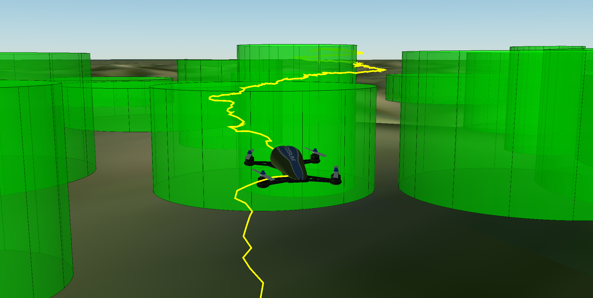
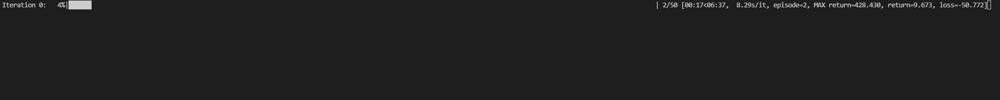
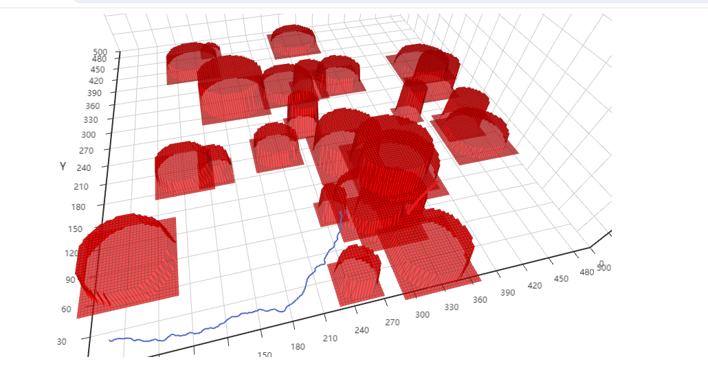
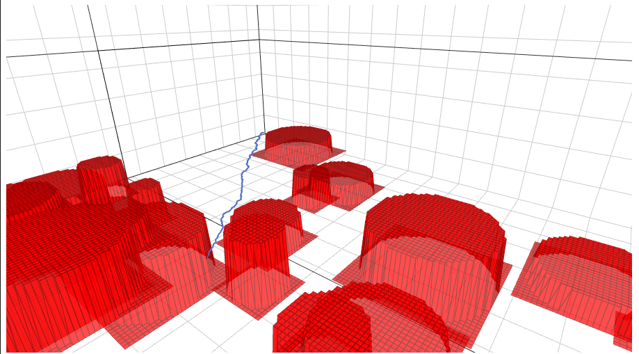
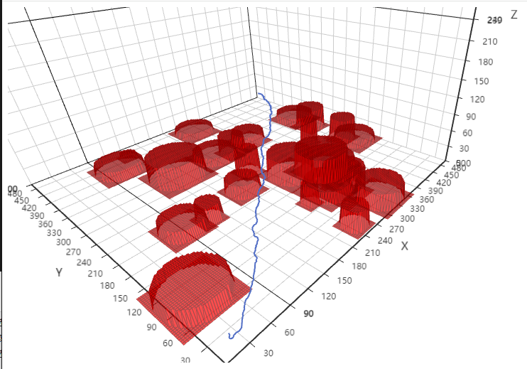
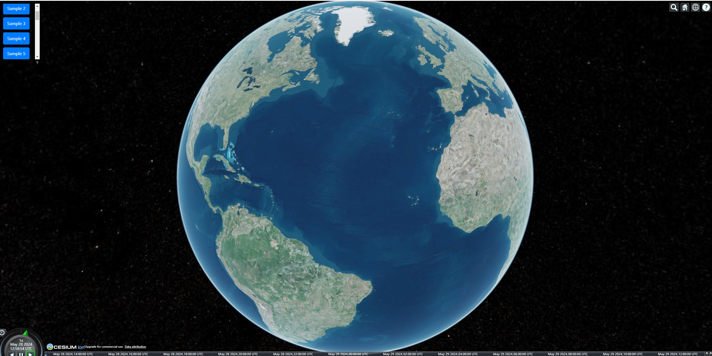

# RLGF             


RLGF是一个适用于无人机深度强化学习任务的通用训练框架，构建了适用于无人机任务的动作模型，包括连续飞行动作与离散飞行动作。预置了飞行能量消耗模型与航线规划模型。能够根据自身任务自定义任务环境模型与无人机模型。并集成了多种主流的深度强化学习算法。
+ 自定义开发： 该框架以配置XML文件的形式制定无人机强化学习任务，隐藏了深度强化学习过程的过程。仅需要重写环境模型与无人机模型中特定的函数，便能快速实现自定义无人机任务的开发。
+ 多算法集成： 集成了主流的强化学习算法如DQN、AC、DDQN、DuelingDQN、PPO、SAC、DDPG，仅需通过配置XML文件即可快速更换任务所需算法进行训练。
+ 无人机参数自定义： 能够根据XML文件配置无人机的性能参数，包括加速度、动作更新函数、状态空间函数、APF动态避障模式是否启用、初始坐标、最大/最小速度、最大转向角、最大任务时间步长、子任务粒度、飞行功耗参数（不同速度下无人机的飞行功耗不同）、通信功率等。也支持自定义无人机参数并载入进自定义的无人机模型。
+ 训练日志支持: 能够将训练过程中的参数以csv的形式保存在logs文件夹下（需自定义保存形式）。
+ 多维度无人机轨迹结果可视化：每轮任务迭代后将生成轨迹以HTML的形式保存在/DataBase/experience目录下。若本地或者服务器配置有MySQL数据库，可以通过提供的接口将航线数据存放到数据库中，并通过PathViewer的java后端项目实现每次迭代任务的无人机轨迹动态可视化。
+ 支持私密消息： 服务端能够通过特定指令向公屏发送指定用户可见的私密消息，可用于文字交互游戏的角色分发。

## 开发环境
+ 训练环境： Python 3.9.7, Pytorch 1.11.0.
+ 可视化平台： jdk 17, Spring 6.15, maven, MySQL 10.3.19.

## 项目目录简介

- RLGF/
  - README.md
  - requirements.txt
  - Agents/     &nbsp;&nbsp;&nbsp;#智能体模型所在目录，存放无人机或其他有关的智能体模型
  - BaseClass/ &nbsp;&nbsp;&nbsp;#存放基本的模型基类，以及通用计算工具
  - config/
    - buildings.xml  &nbsp;&nbsp;&nbsp;#环境中的建筑物配置文件。
    - DB.xml  &nbsp;&nbsp;&nbsp;#数据库配置，若无数据库，可以忽略。
    - PathPlan_City.xml &nbsp;&nbsp;&nbsp;#案例环境模型的配置文件，定义了1个UAV在建筑群中执行航线规划任务。
    - Trainer.xmll &nbsp;&nbsp;&nbsp;#所采用的训练器的配置文件。
    - UAV.xml &nbsp;&nbsp;&nbsp;#案例无人机配置文件，定义了UAV在轨迹规划任务中的相关配置。
    - UI.xml &nbsp;&nbsp;&nbsp;#PyEchart配置文件，不建议更改。
  - DataBase/
    - experience/   &nbsp;&nbsp;&nbsp;#以html的形式存放无人机的轨迹结果（静态）。
    - Connector.py &nbsp;&nbsp;&nbsp;#提供连接数据库的功能。
  - Env/  &nbsp;&nbsp;&nbsp;#存放环境模型类。
  - FactoryClass/  &nbsp;&nbsp;&nbsp;#对应的工厂类。
  - logs/ &nbsp;&nbsp;&nbsp;#存放运行日志。
  - Mod/  &nbsp;&nbsp;&nbsp;#存放神经网络模型。
  - Obstacles/  &nbsp;&nbsp;&nbsp;#存放自定义的障碍物类。
  - Trainer/  &nbsp;&nbsp;&nbsp;#存放已经实现的强化学习算法训练器。
  - simulator.py &nbsp;&nbsp;&nbsp;#训练器启动器。


## 基本使用案例

### 模型训练：

修改案例环境配置文件PathPlan_City。
```
<simulator>
    <env>
        <Env_Type>PathPlan_City</Env_Type>   <!-- 自定义环境模型名称，与py文件名一致-->
        <len>500</len>  <!-- 环境规划空间长度-->
        <width>500</width>  <!-- 环境规划空间宽度-->
        <h>100</h>  <!-- 环境规划空间高度-->
        <eps>0.1</eps>  <!-- epslon最小贪心概率-->
        <Is_AC>0</Is_AC> 
        <Is_FL>0</Is_FL>   <!-- 是否启用联邦学习进行分布式训练（需要多个智能体）-->
        <Is_On_Policy>0</Is_On_Policy> 
        <FL_Loop>3</FL_Loop> 
        <print_loop>2</print_loop>
        <num_UAV>1</num_UAV> <!-- 无人机数目-->
        <Agent>
            <xml_path_agent>./config/UAV.xml</xml_path_agent>   <!-- 案例无人机的配置文件-->
            <Trainer>
                <Trainer_path>./config/Trainer.xml</Trainer_path>  <!-- 训练器的配置文件-->
            </Trainer>
        </Agent>
        <Obstacles>
            <buildings>./config/buildings.xml</buildings>  <!-- 建筑物分布的配置文件-->
        </Obstacles>
        <UI>
            <UI_path>./config/UI.xml</UI_path>
        </UI>
        <DB>
            <DB_path>./config/DB.xml</DB_path>  <!-- 数据库配置文件-->
        </DB>
    </env>
    <record_epo>10</record_epo> 
    <num_episodes>500</num_episodes>   <!-- 迭代次数-->
    <max_eps_episode>1</max_eps_episode>
    <min_eps>0.1</min_eps>
    <TARGET_UPDATE>3</TARGET_UPDATE>
</simulator>
```

运行simulator.py文件，即可启动训练过程。支持断点训练。每次运行会在/logs生成一个日志，可以查看每轮次训练的得分详情。并在/DataBase/experience目录下生成无人机轨迹。

训练过程：


每个训练轮次生成的静态轨迹HTML




基于cesium的训练过程动态可视化

